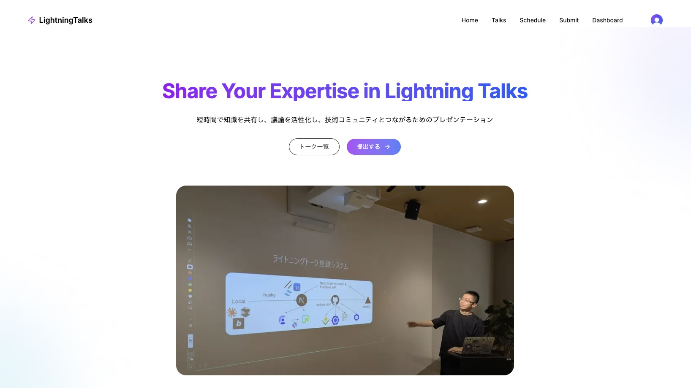
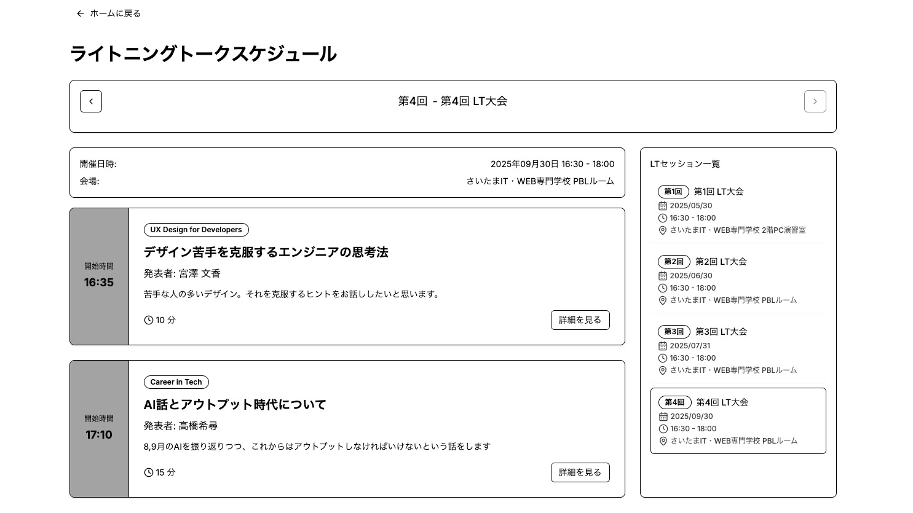
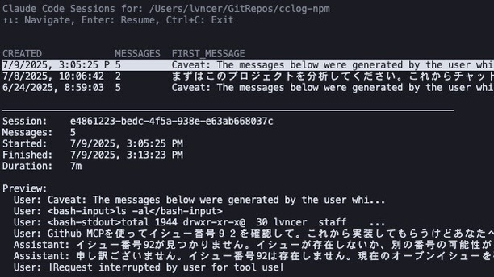
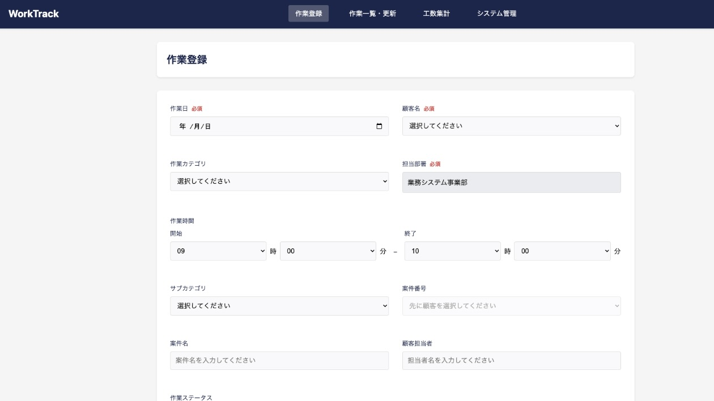
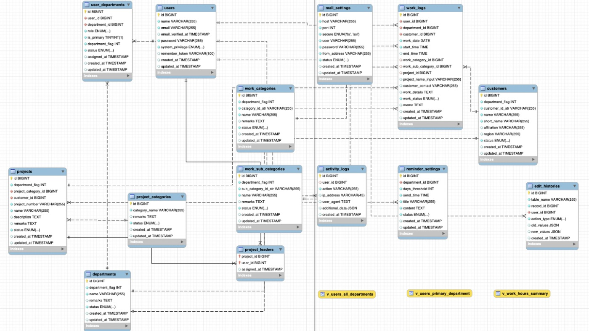

<h1 class="text-black text-4xl font-medium text-center mb-4">Portfolio Slide</h1>

Takahashi Kihiro

---

  <h1 class="text-4xl font-bold">アジェンダ</h1>

  

    <ol class="text-xl">
      <li class="pb-4">自己紹介</li>
      <li class="pb-4">スキル紹介</li>
      <li class="pb-4">自己PR</li>
    </ol>
  

  

    <ol class="text-xl" start="4">
      <li class="pb-4">個人開発紹介 1</li>
      <li class="pb-4">個人開発紹介 2</li>
      <li class="pb-4">チーム開発紹介 1</li>
      <li class="pb-4">チーム開発紹介 2</li>
    </ol>
  

---

  <h1 class="text-4xl font-bold">自己紹介</h1>

  

    
  

  

    
さいたまIT・WEB専門学校 高度専門士情報技術科

    
名前：高橋 希尋

    
趣味：AI駆動開発、ガジェット、テックイベント

    
基本情報技術者 / 情報セキュリティマネジメント

    

      <a href="https://www.lvncer.dev/" class="text-blue-600 hover:text-blue-800">www.lvncer.dev/</a>
    

    

      <a href="https://x.com/kihhi_" class="text-blue-600 hover:text-blue-800">@kihhi_</a>
    

  

---

  <h1 class="text-4xl font-bold">スキル紹介</h1>

  

    <ul class="list-disc list-inside mb-4">
      <li>Python
        <ul class="list-disc list-inside mb-4">
          <li>Fast API / Flask / Django</li>
          <li>Pandas / Scikit-learn</li>
        </ul>
      </li>
      <li>JavaScript / TypeScript
        <ul class="list-disc list-inside mb-4">
          <li>Node.js / Tailwind CSS</li>
          <li>React / Next.js</li>
        </ul>
      </li>
      <li>PHP</li>
      <li>Ruby on Rails / Swift / Go ...</li>
      <li>Web セキュリティ</li>
      <li>ハードウェア</li>
    </ul>
  

  

    <ul class="list-disc list-inside mb-4">
      <li>Database
        <ul class="list-disc list-inside mb-4">
          <li>MySQL / PostgreSQL</li>
        </ul>
      </li>
      <li>Devs / Infla
        <ul class="list-disc list-inside mb-4">
          <li>Github / Gitlab</li>
          <li>Docker / k8s</li>
          <li>AWS</li>
          <li>Vercel</li>
        </ul>
      </li>
      <li>AI
        <ul class="list-disc list-inside mb-4">
          <li>Cursor / Devin</li>
        </ul>
      </li>
    </ul>
  

---

  <h1 class="text-4xl font-bold">自己PR</h1>

  

    <ol class="list-disc list-inside mb-4">
      <li>コミュニケーション能力の高さ
        <ul class="list-disc list-inside mb-4">
          <li>チーム開発でのスムーズなやりとり</li>
          <li>クライアントとの折衝経験</li>
        </ul>
      </li>
      <li>主体性・誠実性の高さ
        <ul class="list-disc list-inside mb-4">
          <li>個人開発でAIなどの最新情報を常にキャッチアップ</li>
          <li>オープンな会話を推進し、インシデント発生時は即時連絡</li>
        </ul>
      </li>
      <li>豊富な経験
        <ul class="list-disc list-inside mb-4">
          <li>ドローンプログラミング全国大会で優勝経験あり</li>
          <li>学校内外でさまざまなプロジェクトマネージャーを担当</li>
          <li>学内の授業アシスタントで後輩にサポート</li>
        </ul>
      </li>
    </ol>
  

---

  <h1 class="text-4xl font-bold">個人開発作品 1.</h1>

  

    
  

  

    <h3 class="text-xl font-bold">LT登録サイト</h3>
    

      <a href="https://siw-lt.vercel.app/" class="text-blue-600 hover:text-blue-800">siw-lt.vercel.app/</a>
    

    

      <h5 class="font-bold mb-2">使用技術スタック</h5>
      <ul class="list-disc list-inside mb-3 text-sm">
        <li>TypeScript / Next.js / Tailwind CSS</li>
        <li>Clerk / Neon / Vercel / Github Actions</li>
      </ul>
    

  

  

    

      <h5 class="font-bold">なぜ開発したか</h5>
      <ul class="list-disc list-inside mb-3 text-sm">
        <li>SIWの学生がライトニングトークを管理するため</li>
        <li>他ユーザーも閲覧できるようにするため</li>
      </ul>
      <h5 class="font-bold">主要機能</h5>
      <ul class="list-disc list-inside text-sm">
        <li>LT発表者の登録・管理機能</li>
        <li>発表スケジュールの自動管理機能</li>
      </ul>
    

  

  

    
  

---

  <h1 class="text-4xl font-bold">個人開発作品 2.</h1>

  

    
    <h3 class="text-xl font-bold">echoes</h3>
    

      <a href="https://echoes-livid.vercel.app/" class="text-blue-600 hover:text-blue-800">echoes-livid.vercel.app/</a>
    

    

      <ul class="list-disc list-inside mb-3 text-sm">
        <li>3D モデルとの会話機能・音声合成</li>
        <li>Next.js / Three.js / AI SDK / PlayWright</li>
      </ul>
    

  

  

    

      
      <h3 class="text-xl font-bold">cclog</h3>
      

        <a href="https://github.com/lvncer/cclog" class="text-blue-600 hover:text-blue-800">@lvncer/cclog</a>
      

      <ul class="list-disc list-inside mb-3 text-sm">
        <li>Claude Code 会話履歴ブラウザー</li>
        <li>TypeScript</li>
      </ul>
    

  

---

  <h1 class="text-4xl font-bold">チーム開発作品 1.</h1>

  

    
  

  

    <h3 class="text-xl font-bold">ライブ演出システム livefx</h3>
    

      <a href="https://zenn.dev/tkszenn/articles/2e73439f678488/" class="text-blue-600 hover:text-blue-800">zenn.dev/tkszenn/articles/2e73439f678488/</a>
    

    

      <h5 class="font-bold">使用技術スタック</h5>
      <ul class="list-disc list-inside text-sm">
        <li>TypeScript / React / Tailwind CSS / WebSocket</li>
        <li>Node.js / Express </li>
        <li>k8s / Grafana / Prometheus / AWS</li>
      </ul>
      <h5 class="font-bold">担当</h5>
      <ul class="list-disc list-inside text-sm">
        <li>プロジェクトマネージャー / フロントエンド</li>
      </ul>
      <h5 class="font-bold">期間</h5>
      <ul class="list-disc list-inside text-sm">
        <li>2 ヶ月</li>
      </ul>
      <h5 class="font-bold">特徴</h5>
      <ul class="list-disc list-inside text-sm">
        <li>MIDI コントローラーからの画面遷移指示</li>
        <li>最大6000台のアクセス処理想定</li>
        <li>タイミング同期とスリープ防止</li>
      </ul>
    

  

  <a href="https://www.siw.ac.jp/archives/news/6050" class="text-blue-600 hover:text-blue-800">https://www.siw.ac.jp/archives/news/6050</a>

---

  <h1 class="text-4xl font-bold">チーム開発作品 2.</h1>

  

    <h3 class="text-xl font-bold">社内工数管理システム worktrack</h3>
    

      <a href="https://zenn.dev/tkszenn/articles/1d5e63cfd0d5bc" class="text-blue-600 hover:text-blue-800">zenn.dev/tkszenn/articles/1d5e63cfd0d5bc</a>
    

    

      <h5 class="font-bold">使用技術スタック</h5>
      <ul class="list-disc list-inside text-sm">
        <li>Amazon Linux / Apache / MySQL (RDS) / PHP</li>
      </ul>
      <h5 class="font-bold">担当</h5>
      <ul class="list-disc list-inside text-sm">
        <li>プロダクトマネージャー</li>
      </ul>
      <h5 class="font-bold">期間</h5>
      <ul class="list-disc list-inside text-sm">
        <li>約 4 ヶ月</li>
      </ul>
      <h5 class="font-bold">特徴</h5>
      <ul class="list-disc list-inside text-sm">
        <li>企業連携授業にて受託開発</li>
        <li>複雑な権限管理システムの実装</li>
        <li>全データ変更の履歴追跡機能</li>
        <li>実運用環境での保守・運用</li>
      </ul>
    

  

  

    
    
  

---
layout: center
background: white
---

  <h1 class="text-4xl font-bold mb-4">ご清聴ありがとうございました</h1>

