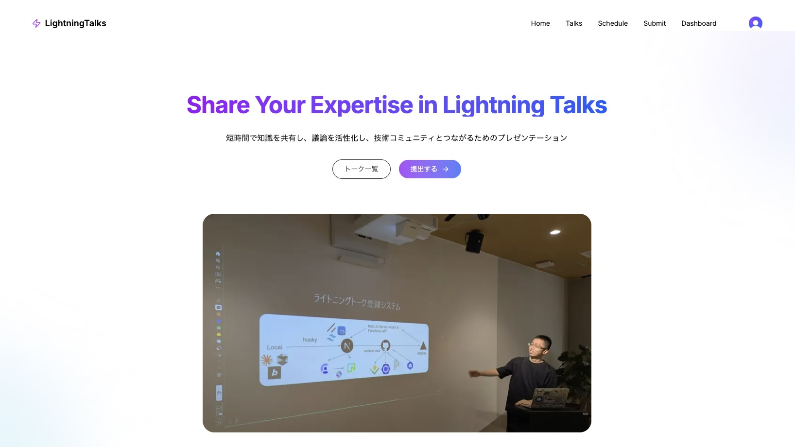
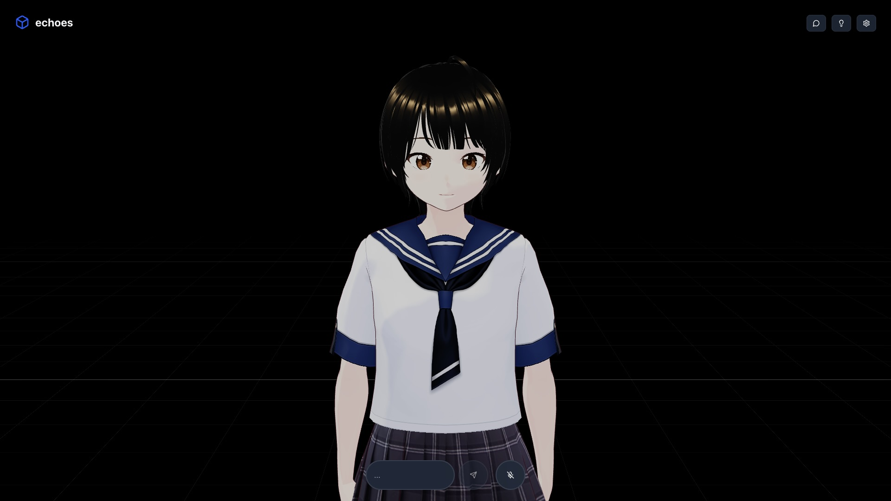

<h1 class="text-4xl font-medium text-center">Portfolio Slide</h1>

Takahashi Kihiro

---

  <h1 class="text-4xl font-bold">自己紹介</h1>

  

    
  

  

    <ul class="list-disc list-inside">
      <li>さいたまIT・WEB専門学校 4 年制</li>
      <li>名前：高橋 希尋</li>
      <li>趣味
        <ul class="list-disc list-inside">
          <li>AI駆動開発、ガジェット、テックイベント</li>
        </ul>
      </li>
      <li>資格
        <ul class="list-disc list-inside">
          <li>基本情報技術者</li>
          <li>情報セキュリティマネジメント</li>
          <li>普通自動車第一種運転免許</li>
        </ul>
      </li>
      <li>
        <dev class="text-blue-400">https://www.lvncer.dev/</dev>
      </li>
      <li>
        <dev class="text-blue-400">@kihhi_</dev>
      </li>
    </ul>
  

---

  <h1 class="text-4xl font-bold">スキル紹介</h1>

  

    

      <h4 class="font-semibold mb-1">Python</h4>
      <ul class="list-disc list-inside pl-6 mb-3 text-sm">
        <li>Fast API / Flask / Django</li>
        <li>機械学習</li>
      </ul>
      <h4 class="font-semibold mb-1">Javascript / Typescript</h4>
      <ul class="list-disc list-inside pl-6 mb-3 text-sm">
        <li>Tailwind CSS</li>
        <li>React / Next.js</li>
        <li>Node.js / Express</li>
        <li>Biome</li>
        <li>Prisma / Drizzle</li>
      </ul>
      <h5 class="font-bold mb-1">PHP</h5>
      <h5 class="font-bold mb-1">Ruby on Rails / Swift / Go ...</h5>
      <h5 class="font-bold">Web セキュリティ</h5>
    

  

  

    

      <h4 class="font-semibold mb-1">データベース</h4>
      <ul class="list-disc list-inside pl-6 mb-3 text-sm">
        <li>MySQL</li>
        <li>PostgreSQL (Supabase / Neon / RDS)</li>
        <li>NoSQL (Firebase)</li>
      </ul>
      <h4 class="font-semibold mb-1">開発者ツール、インフラ</h4>
      <ul class="list-disc list-inside pl-6 mb-3 text-sm">
        <li>Figma</li>
        <li>Github / Gitlab</li>
        <li>Docker / k8s</li>
        <li>AWS / Vercel</li>
        <li>Clerk</li>
      </ul>
      <h5 class="font-bold">AI</h5>
      <ul class="list-disc list-inside pl-6 mb-3 text-sm">
        <li>Cursor / Devin</li>
      </ul>
    

  

---

  <h1 class="text-4xl font-bold">個人開発作品 1. LT 登録サイト</h1>

  

    
  

  

    <h3 class="text-xl font-bold"></h3>
    

      
siw-lt.vercel.app/

    

    

      <h5 class="font-bold mb-2">使用技術スタック</h5>
      <ul class="list-disc list-inside mb-3 text-sm">
        <li>TypeScript / Next.js / Tailwind CSS</li>
        <li>Clerk / Neon / Vercel / Github Actions</li>
      </ul>
    

  

  

    

      <h5 class="font-bold">なぜ開発したか</h5>
      <ul class="list-disc list-inside mb-3 text-sm">
        <li>SIWの学生がライトニングトークを管理するため</li>
        <li>他ユーザーも閲覧できるようにするため</li>
      </ul>
      <h5 class="font-bold">主要機能</h5>
      <ul class="list-disc list-inside text-sm">
        <li>LT発表者の登録・管理機能</li>
        <li>発表スケジュールの自動管理機能</li>
      </ul>
    

  

  

    
  

---

  <h1 class="text-4xl font-bold">個人開発作品 2.</h1>

  

    
  

  

    <h3 class="text-xl font-bold">echoes</h3>
    

      
https://echoes-livid.vercel.app/

    

    

      
VRMモデルとAI を介してリアルタイムに音声会話

      <h5 class="font-bold">使用技術スタック</h5>
      <ul class="list-disc list-inside mb-3 text-sm">
        <li>Next.js / Zustand / AI SDK / Three.js</li>
      </ul>
    

  

  

    
それ以外にも

    <ul class="list-disc list-inside mb-3 text-sm">
      <li>VRM モデルを AI が自然言語で制御できる MCP リモートサーバー「VRMCP」</li>
      <li>AI との会話練習でコミュニケーション力を向上させる Web アプリ「kaiwa-dash」</li>
      <li>Claude CodeのCLI会話履歴ブラウザーの npm パッケージ「cclog」</li>
      <li>マークダウンファイルから名刺を作成できる npm パッケージ「name-card」</li>
      <li>ブックマーク管理アプリ「bookmarks」</li>
      <li>シンプルなSNSアプリ「NextSNS」...</li>
    </ul>
  

---

  <h1 class="text-4xl font-bold">チーム開発作品 1.</h1>

  

    <h3 class="text-xl font-bold">社内工数管理システム worktrack</h3>
    

      zenn.dev/tkszenn/articles/1d5e63cfd0d5bc
    

    

      <h5 class="font-bold">使用技術スタック</h5>
      <ul class="list-disc list-inside text-sm">
        <li>Amazon Linux / Apache / MySQL (RDS) / PHP</li>
      </ul>
      <h5 class="font-bold">担当</h5>
      <ul class="list-disc list-inside text-sm">
        <li>プロダクトマネージャー、DB設計</li>
      </ul>
      <h5 class="font-bold">期間</h5>
      <ul class="list-disc list-inside text-sm">
        <li>約 4 ヶ月</li>
      </ul>
      <h5 class="font-bold">特徴</h5>
      <ul class="list-disc list-inside text-sm">
        <li>企業連携授業にて受託開発</li>
        <li>複雑な権限管理システムの実装</li>
        <li>全データ変更の履歴追跡機能</li>
        <li>今後は実運用環境での保守・運用</li>
      </ul>
    

  

  

    
    
  

---

  <h1 class="text-4xl font-bold">チーム開発作品 2. 「ドロカツ」</h1>

  

    
  

  

    
  

  

    
全国大会 プログラミング部門優勝

    
Pythonを用いてドローン「CoDrone EDU」を操作

    
自動操縦の精度や、課題クリアにかかった時間などで競う

  

---

  <h1 class="text-4xl font-bold">チーム開発作品 3.「ライブ演出システム LiveFx」</h1>

  

    
  

  

    <h3 class="text-xl font-bold"></h3>
    

      zenn.dev/tkszenn/articles/2e73439f678488/
    

    

      <h5 class="font-bold">使用技術スタック</h5>
      <ul class="list-disc list-inside text-sm">
        <li>TypeScript / React / Tailwind CSS / WebSocket</li>
        <li>Node.js / Express </li>
        <li>k8s / Grafana / Prometheus / AWS</li>
      </ul>
      <h5 class="font-bold">担当</h5>
      <ul class="list-disc list-inside text-sm">
        <li>プロジェクトマネージャー / フロントエンド</li>
      </ul>
      <h5 class="font-bold">期間</h5>
      <ul class="list-disc list-inside text-sm">
        <li>2 ヶ月</li>
      </ul>
      <h5 class="font-bold">特徴</h5>
      <ul class="list-disc list-inside text-sm">
        <li>MIDI コントローラーからの画面遷移指示</li>
        <li>最大6000台のアクセス処理想定</li>
        <li>タイミング同期とスリープ防止</li>
      </ul>
    

  

---

  <h1 class="text-4xl font-bold">自己PR</h1>

  

    <ol class="list-disc list-inside mb-4">
      <li>コミュニケーション能力の高さ
        <ul class="list-disc list-inside mb-4">
          <li>チーム開発でメンバー間でのスムーズなやりとり</li>
          <li>クライアントとの折衝経験</li>
        </ul>
      </li>
      <li>主体性・誠実性の高さ
        <ul class="list-disc list-inside mb-4">
          <li>個人開発でAIなどの最新情報を常にキャッチアップ</li>
          <li>オープンな会話を推進し、インシデント発生時は即時連絡</li>
        </ul>
      </li>
      <li>豊富な経験
        <ul class="list-disc list-inside mb-4">
          <li>さまざまなプロジェクトマネージャーを担当</li>
          <li>学校内外でフルスタックに開発を経験</li>
          <li>学内の授業アシスタントで後輩にサポート</li>
        </ul>
      </li>
    </ol>
  

